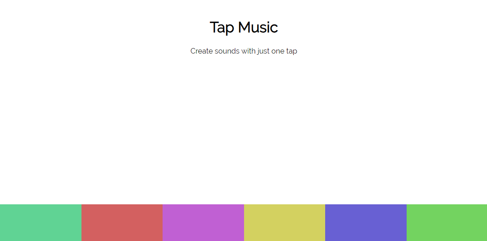

# JS-Music-Pads
A Simple Music App using Vanilla JavaScript, CSS and HTML.

## Steps to execute this app:
- Download the entire code 
- Open up the index.html.
- That's it!

## Technologies used:
- HTML
- CSS [style/Presentation]
- Javascript [Logic/Working of the app]

